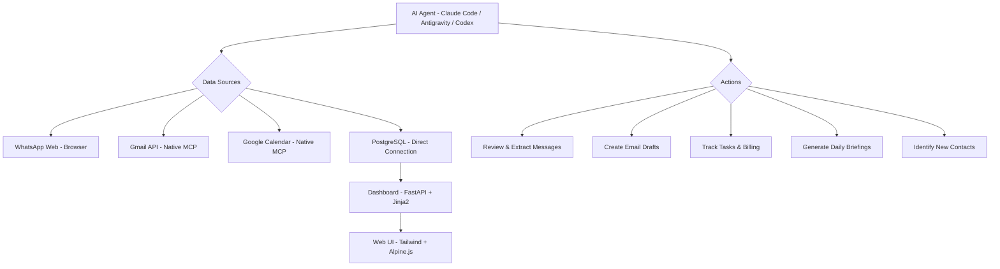
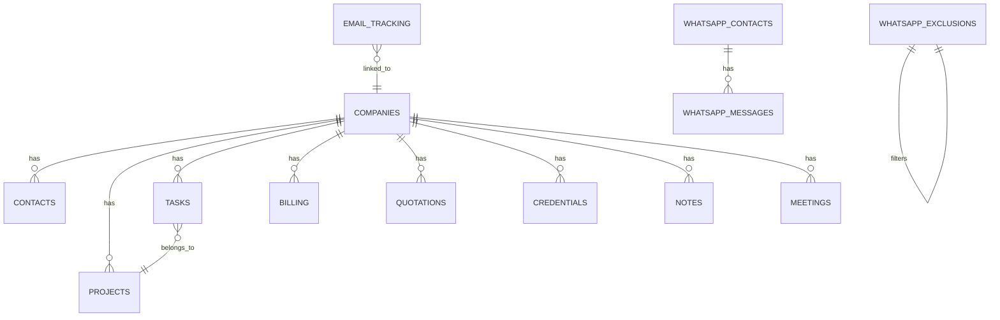

# PM Claude Code - AI Project Manager Agent


> Turn any AI coding assistant into your personal project manager. Automate WhatsApp reviews, email triage, calendar management, task tracking, and daily briefings using Claude Code, Antigravity, Codex, or any AI agent with browser and API access.

---

## The Problem

| Without PM Agent | With PM Agent |
|---|---|
| Manually checking 50+ WhatsApp chats daily | Agent scans chats, filters exclusions, extracts action items |
| Missing follow-ups buried in email threads | Auto-triages emails, creates drafts, tracks pending responses |
| Forgetting meetings and deadlines | Calendar-aware briefings with preparation notes |
| No centralized view of clients, tasks, billing | PostgreSQL dashboard with 20+ normalized tables |
| Hours spent on status updates | One-command daily brief with priorities by team member |

---

## How It Works



---

## Key Features

### 1. WhatsApp Review Agent
- Opens WhatsApp Web via browser automation
- Filters chats using a configurable exclusion list (personal, communities, spam)
- Enters each work chat, reads messages, identifies action items
- Registers new contacts and unsaved numbers
- Creates follow-up tasks automatically
- **Never sends messages without explicit confirmation**

### 2. Gmail Review Agent
- Connects natively via Gmail MCP (OAuth)
- Filters by category: work, reports, notifications
- Creates email drafts for follow-ups (never sends directly)
- Tracks actionable emails in database
- Links emails to clients and projects

### 3. Calendar-Aware Briefings
- Reads Google Calendar via native MCP
- Identifies conflicts and preparation needs
- Generates daily agenda with context per meeting
- Cross-references calendar with pending tasks

### 4. Centralized Database
- 20 normalized PostgreSQL tables
- Companies as central entity
- Contacts, projects, tasks, billing, quotations
- WhatsApp contacts directory with exclusion list
- Email tracking and review logs
- Encrypted credentials storage (Fernet)

### 5. Task Management
- Priority-based: Urgente > Alta > Media > Baja
- Status tracking: Pendiente > En Progreso > Cerrado
- Assignment by team member
- Due date tracking with overdue alerts
- Batch operations support

---

## Quick Start

### Prerequisites

- Python 3.12+
- PostgreSQL database (Railway, Supabase, or local)
- An AI coding agent with:
  - Browser automation capability (for WhatsApp)
  - Gmail API access (native MCP or OAuth)
  - Google Calendar API access
  - Ability to run Python scripts and SQL queries

### 1. Clone the repository

```bash
git clone https://github.com/tamibot/pm_claude_code.git
cd pm_claude_code
```

### 2. Set up the database

```bash
# Create your .env file
cp .env.example .env
# Edit with your DATABASE_URL, ENCRYPTION_KEY, etc.

# Run the schema
python scripts/migrate.py
```

### 3. Configure your AI agent

Copy the `.claude/` folder to your project root. This contains:
- `commands/` - Slash commands (daily-brief, review-wa, review-gmail)
- `rules/` - Project conventions and team responsibilities
- `agents/` - Specialized agent configurations

### 4. Set up integrations

| Integration | Method | Setup |
|-------------|--------|-------|
| WhatsApp | Browser (Chrome) | Log into web.whatsapp.com in your browser |
| Gmail | Native MCP (OAuth) | Connect via Claude Code MCP settings |
| Google Calendar | Native MCP (OAuth) | Connect via Claude Code MCP settings |
| PostgreSQL | Direct connection | Set DATABASE_URL in .env |

### 5. Configure the exclusion list

```sql
-- Add chats to skip during WhatsApp review
INSERT INTO whatsapp_exclusions (chat_name, exclusion_type)
VALUES
  ('Family Group', 'personal'),
  ('n8n Community', 'comunidad'),
  ('Spam Bot', 'spam');
```

### 6. Run your first daily brief

```
/daily-brief
```

---

## Project Structure

```
pm_claude_code/
|
|-- docs/                          # Detailed guides
|   |-- 01-database-setup.md       # Schema design and tables
|   |-- 02-integrations.md         # WhatsApp, Gmail, Calendar setup
|   |-- 03-agent-commands.md       # Slash commands reference
|   |-- 04-task-management.md      # How to track tasks and billing
|   |-- 05-daily-workflow.md       # Daily review process
|   |-- 06-team-setup.md           # Multi-person team configuration
|   +-- 07-security.md            # Credentials and encryption
|
|-- templates/                     # Ready-to-use templates
|   |-- CLAUDE.md                  # Main project instructions for AI
|   |-- schema.sql                 # Complete database DDL
|   |-- .env.example               # Environment variables template
|   +-- weekly-review.md          # Weekly review template
|
|-- examples/                      # Example configurations
|   |-- exclusion-list.sql         # Sample WhatsApp exclusions
|   |-- sample-tasks.sql           # Sample task entries
|   +-- sample-contacts.sql       # Sample contact entries
|
|-- scripts/                       # Utility scripts
|   |-- migrate.py                 # Database migration runner
|   +-- seed.py                   # Sample data seeder
|
|-- .claude/                       # AI agent configuration
|   |-- commands/
|   |   |-- daily-brief.md         # /daily-brief command
|   |   |-- review-wa.md           # /review-wa command
|   |   |-- review-gmail.md        # /review-gmail command
|   |   +-- update-task.md        # /update-task command
|   |-- rules/
|   |   |-- project-conventions.md # Data conventions
|   |   |-- api-conventions.md     # API standards
|   |   +-- team-responsibilities.md # Team roles
|   +-- agents/
|       +-- task-manager.md       # Task management agent
|
|-- README.md                      # This file
|-- requirements.txt               # Python dependencies
|-- .gitignore                     # Git ignore rules
+-- LICENSE                       # MIT License
```

---

## Database Schema Overview

The system uses 20 normalized tables centered on `companies` as the main entity:



### Core Tables

| Table | Purpose | Key Fields |
|-------|---------|------------|
| `companies` | Clients and internal companies | name, status, sector_id |
| `contacts` | People per company | name, phone, email, role |
| `projects` | GitHub repos / deliverables | repo_url, tech_stack, status |
| `tasks` | All pending work | title, priority, due_date, status |
| `billing` | Income and expenses | amount_usd, payment_status |
| `quotations` | Sales pipeline | status, next_followup_date |
| `credentials` | Encrypted service logins | password_encrypted (Fernet) |

### Tracking Tables

| Table | Purpose | Key Fields |
|-------|---------|------------|
| `whatsapp_contacts` | WA directory | chat_name, should_review |
| `whatsapp_exclusions` | Chats to skip | chat_name, exclusion_type |
| `whatsapp_messages` | Key messages logged | action_required, action_description |
| `email_tracking` | Actionable emails | action_required, company_id |
| `review_log` | Audit trail | review_type, chats_reviewed |

---

## Compatible AI Tools

This system is designed to work with any AI coding agent that supports:

| Tool | Browser | Gmail MCP | Calendar MCP | Terminal |
|------|---------|-----------|--------------|----------|
| **Claude Code** | Via Chrome MCP | Native | Native | Yes |
| **Antigravity** | Built-in | Via MCP | Via MCP | Yes |
| **Codex (OpenAI)** | Via plugins | Via API | Via API | Yes |
| **Cursor** | Via extension | Via MCP | Via MCP | Yes |
| **Windsurf** | Via extension | Via MCP | Via MCP | Yes |

### Integration Requirements

1. **Browser access** (for WhatsApp): The AI agent needs to control a browser window with WhatsApp Web logged in. This can be via Chrome MCP, Computer Use, or browser automation tools.

2. **Email access**: Preferably via native Gmail MCP for direct API access. Alternatively, the agent can use browser automation with Gmail open.

3. **Calendar access**: Native Google Calendar MCP is recommended. Allows reading events, checking availability, and creating meetings.

4. **Database access**: Direct PostgreSQL connection via `psycopg2` or similar. The agent runs SQL queries to read/write all data.

---

## Daily Workflow

```mermaid
graph LR
    A[Morning] --> B[Run /daily-brief]
    B --> C[Review priorities by person]
    C --> D[Run /review-wa]
    D --> E[Check unread chats]
    E --> F[Register action items]
    F --> G[Run /review-gmail]
    G --> H[Triage emails]
    H --> I[Create drafts]
    I --> J[Check calendar]
    J --> K[Prepare for meetings]
    K --> L[Update tasks]
    L --> M[Generate weekly review]
```



### What the Agent Does Each Morning

1. Queries all tasks due today or overdue
2. Checks pending billing and follow-ups
3. Reviews unread WhatsApp chats (filtering exclusions)
4. Triages new emails
5. Cross-references calendar events
6. Generates actionable brief organized by team member

---

## Security & Privacy

- Passwords are encrypted with **Fernet** (symmetric encryption) before storage
- Encryption key stored in environment variable, never in code
- `.env` and credential files are gitignored
- The agent **never sends messages** without explicit user confirmation
- The agent **never creates accounts** or enters sensitive financial data
- All actions are logged in `activity_log` and `review_log` tables

---

## Roadmap

- [x] Core database schema (20 tables)
- [x] WhatsApp review with exclusion list
- [x] Gmail triage and draft creation
- [x] Calendar integration
- [x] Daily briefing generation
- [x] Task management with priorities
- [ ] Automated scheduled reviews (cron-based)
- [ ] Multi-language support
- [ ] Slack/Teams integration
- [ ] Mobile-friendly dashboard
- [ ] AI-powered task prioritization
- [ ] Client portal for external visibility

---

## Contributing

We welcome contributions! Areas where you can help:

| Area | What's Needed |
|------|---------------|
| Database schemas | New table designs for specific industries |
| Agent commands | New slash commands for common workflows |
| Integrations | Slack, Teams, Notion, Linear connectors |
| Documentation | Guides in other languages |
| Templates | Industry-specific templates |

---

## Contact

| Channel | Details |
|---------|---------|
| GitHub | [@tamibot](https://github.com/tamibot) |
| Email | mvelascoo@tamibot.com |
| WhatsApp | +51 995 547 575 |

---

## License

This project is licensed under the MIT License - see the [LICENSE](LICENSE) file for details.

---

> Built with Claude Code by [Creators Latam](https://github.com/tamibot) | Turning AI agents into operational teammates.
